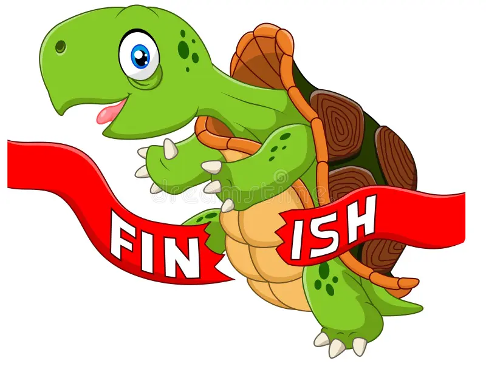

# 🐢 Turtle Crossing Capstone Project 🚦

The Turtle Crossing Capstone project is a fun arcade-style game developed using Python's turtle graphics library. The project serves as a great learning opportunity for both `turtle` graphics and Object-Oriented Programming (OOP) concepts.

## Learning from the Project 📚

- **Turtle Graphics**: The project demonstrates how to use Python's `turtle` graphics library to create a simple and interactive graphical game. It covers topics like drawing shapes, moving turtles, and handling user input.

- **Object-Oriented Programming (OOP)**: The game design follows the principles of OOP by implementing classes and objects. The project is organized into different classes, such as `Player`, `CarManager`, and `Scoreboard`, each with its own responsibilities and methods.

- **Encapsulation**: The classes in the project encapsulate related data and behavior, making it easier to manage and maintain the code. The `turtle` graphics library is utilized as part of the `Player` class to create and control the turtle sprite.

- **Inheritance**: The `Player` class inherits from the `turtle.Turtle` class, which allows the player object to have all the functionalities of a regular turtle, with additional game-specific features.

- **Polymorphism**: The game uses the `turtle.Turtle` class to create different objects, such as the player and cars, with different appearances and behaviors. Each object type shares the same base class (`turtle.Turtle`) but behaves differently based on its own implementation.

- **Game Development**: The project illustrates the development process of an arcade-style game, from setting up the game window and creating game objects to handling game logic, player input, and collision detection.

- **Game Design and Logic**: The game's design includes elements like multiple levels, increasing difficulty, and scoring mechanics. The project demonstrates how to implement such game logic using Python and OOP principles.

## Game Objective 🎯

Help the 🐢 turtle cross the road from the bottom of the screen to the top. The turtle must avoid colliding with the 🚗 moving cars. The game will get more challenging as the turtle crosses multiple lanes of traffic.

## Game Controls 🎮

- Use the "w" key to move the 🐢 turtle forward.

## Game Features 🕹️

- The 🐢 turtle starts at the bottom of the screen and must reach the finish line at the top.
- 🚗 Moving cars appear randomly at various lanes on the road.
- The cars move at different speeds, increasing the challenge for the player.
- When the 🐢 turtle reaches the finish line, it advances to the next level with increased difficulty.
- Colliding with a 🚗 car will result in a game over.
- The player's highest score will be displayed at the end of the game.

## Requirements 📝

- Python 3.x
- Turtle graphics library

## Installation and Running the Game 💻

1. Clone this repository to your local machine.

2. Navigate to the project directory.
   
3. Run the game.
4. 
## Contributing 🤝

Contributions to the project are welcome! If you have any improvements or bug fixes, feel free to create a pull request.

## Acknowledgments 🙏

Feel free to explore the project's code and learn from its implementation of `turtle` graphics and OOP concepts. The project provides an excellent foundation for building more complex games and interactive applications using Python. Happy coding and enjoy the learning journey! 🚀

